<!-- # GPA (Group Project Agent) 🎓 -->

> **"Automating the friction of group projects with Automata Theory & LLMs."**

**GPA** is an intelligent agent designed to streamline the chaotic "kickoff" phase of university group projects. By modeling administrative workflows as a **Deterministic Finite Automaton (DFA)**, this tool orchestrates the entire process—from analyzing assignment requirements to establishing collaborative workspaces—eliminating the initial friction of teamwork.

Developed for the **Theory of Computation** course at **National Cheng Kung University (NCKU)**, but now fully configurable for general use.

---

## 💡 Background & Motivation

**The "Cold Start" Problem in General Education Courses**

In General Education (通識) courses, students are often assigned to interdisciplinary teams where members are strangers. The traditional initiation process is friction-heavy and inefficient:
1.  Awkwardly exchanging messaging app IDs (Line/IG).
2.  Creating chat groups manually.
3.  Asking for Student IDs one by one.
4.  Manually creating and sharing Google Docs/Slides links.

**GPA** solves this by automating the entire loop. Students simply input their **Student IDs** (or Emails) during class, and the Agent takes over: parsing the assignment, creating the workspace, and emailing every member with their tasks and access links instantly.

---

## 🎨 Design Philosophy

### Why not just use a shared Google Slide manually?

While a shared document is sufficient *once collaboration has already started*, this project focuses on automating the **initiation phase** of group work. This phase is often the most fragile and delay-prone stage, especially among students who are unfamiliar with each other.

**From Implicit to Explicit Coordination:**
By modeling the project startup process as a finite-state machine, this agent:
* Reduces **social friction** (no need to chase people for emails).
* Enforces **synchronization** (everyone receives the same info at the same time).
* Transforms implicit, human-dependent coordination into an **explicit, reproducible computational workflow**.

---

## ✨ Key Features

* **🤖 Multi-Provider LLM Support**: Supports **OpenAI**, **Google Gemini**, **Ollama (Local)**, and **NCKU Internal API**. Configurable via environment variables.
* **📄 Multi-Modal Output**:
    * **Google Docs**: Generates a comprehensive project proposal and task breakdown.
    * **Google Slides**: Creates a structured presentation outline for the project.
* **☁️ Google Workspace Automation**:
    * **Smart Identity Resolution**: Automatically appends your organization's email domain (configurable).
    * **Secure Auth**: Uses secure JSON token storage and restricted `drive.file` scope (Least Privilege).
    * **Drive & Gmail**: Automatically creates files, manages permissions, and sends kickoff emails.
* **⚡ State Visualization**: Visualizes the agent's workflow as a Directed Acyclic Graph (DAG) in real-time (Pure Python, no system binaries required).

---

## 🧠 System Architecture (Automata Theory)

The agent operates as a robust state machine ($M$) where:

* $Q$ (States): `{Start, Analyze, Create_Doc, Create_Slide, Set_Permission, Notify, End, Error_State}`
* $\Sigma$ (Alphabet): `{User_Input, PDF_Content, API_Response}`
* $\delta$ (Transition Function): The logic defined in `main.py` ensuring a strictly ordered execution sequence.

### Error Handling as States
Unlike traditional scripts that crash on exception, **Failures are explicitly modeled**.
* If an API call (e.g., LLM timeout) fails, the system transitions to a specific error handling state to attempt recovery (Retry Mechanism) or graceful degradation, rather than terminating the process abruptly.



## ⚙️ Environment Setup & Installation

> **Security Notice** > For security best practices, API keys and OAuth credentials are **NOT included** in this repository.  
> Please follow the steps below to reproduce the environment.

### 1. Clone the Repository

```bash
git clone https://github.com/itisJoshuaTseng/GPA-Group-Project-Agent.git
cd GPA-Group-Project-Agent
```

### 2. Install Dependencies

Ensure you have **Python 3.9+** installed.

```bash
pip install -r requirements.txt
```

### 3. Configure API Keys (`.env`)

We use a `.env` file to manage LLM providers and configuration.

Rename the provided template file (if available) or create a new `.env` file:

```bash
# MacOS/Linux
touch .env

# Windows
type NUL > .env
```

Open `.env` and fill in your configuration (Choose **ONE** provider):

```ini
# --- Core Configuration ---
# Options: openai, ollama, gemini, ncku
LLM_PROVIDER=ncku

# Default Email Domain (e.g., gmail.com, gs.ncku.edu.tw)
DEFAULT_EMAIL_DOMAIN=gs.ncku.edu.tw

# ======================================================
# PROVIDER CONFIGURATION (Uncomment the one you are using)
# ======================================================

# --- 1. OpenAI ---
# API_KEY=sk-proj-xxxxxxxxxxxx
# MODEL_NAME=gpt-4o-mini
# API_URL=[https://api.openai.com/v1/chat/completions](https://api.openai.com/v1/chat/completions)

# --- 2. Ollama (Local) ---
# API_KEY=unused
# MODEL_NAME=llama3
# API_URL=http://localhost:11434/api/chat

# --- 3. Google Gemini ---
# API_KEY=AIzaSyxxxxxxxxxxxx
# MODEL_NAME=gemini-1.5-flash

# --- 4. NCKU Internal (Legacy) ---
# API_KEY=your_student_key
# MODEL_NAME=gpt-oss:120b
# API_URL=[https://api-gateway.netdb.csie.ncku.edu.tw/api/chat](https://api-gateway.netdb.csie.ncku.edu.tw/api/chat)
```

### 4. Configure Google OAuth Credentials

To enable Google Workspace automation, you need a Google Cloud Project with the following APIs enabled:

- Google Drive API
- Google Docs API
- Google Slides API
- Gmail API

**Steps:**

1. Download your OAuth 2.0 Client ID JSON file from the Google Cloud Console.
2. Rename the file to `credentials.json`.
3. Place `credentials.json` in the root directory of this project.

> **Note** > On the first run, the application will open a browser window asking for permission to access your Google account.  
> Once granted, a `token.json` file will be generated locally to store the secure session.

---

## 🚀 Usage

Run the Streamlit application:

```bash
python -m streamlit run src/main.py
```

### Workflow

1. **Login**: Authenticate with your Google Account via the sidebar.  
2. **Input**: Enter the course name, Student IDs/Emails, and upload the Assignment PDF.  
3. **Configure**: Select the desired output format (Docs, Slides, or both) and the project deadline.  
4. **Launch**: Click **Start Agent** to initiate the DFA workflow.

---

## 👥 Contributor

- **Ling-Cheng Tseng** — System Architecture, API Integration, Prompt Engineering  

Created for the **Fall 2025 Theory of Computation Final Project**.
